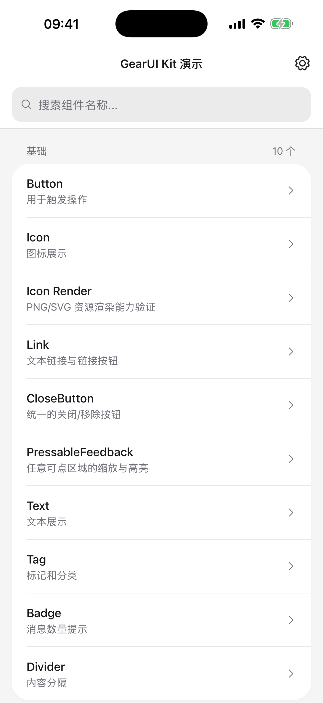
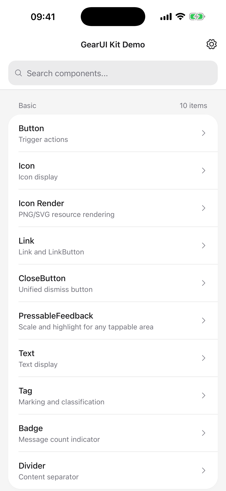
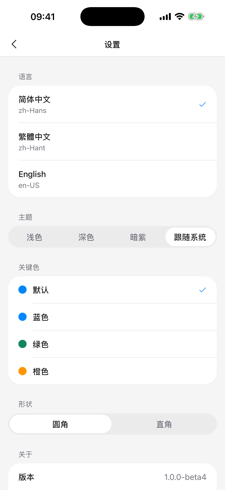
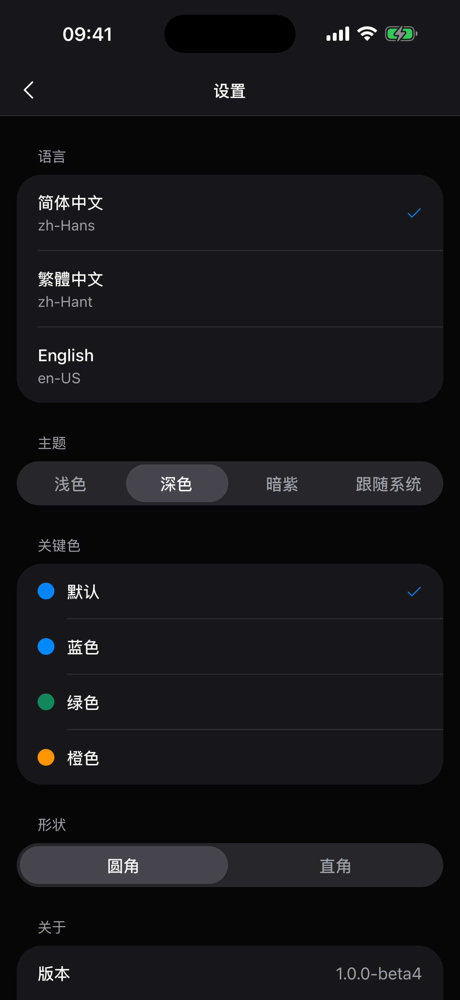

# GearUI Kit

[English](./README.md) | [简体中文](./README.zh-Hans.md)

Build beautiful, iOS-inspired UI across iOS, Android, Web, and HarmonyOS with GearUI Kit, a Kotlin Multiplatform (KMP) UI framework.

## Release Information

- Coordinates: `com.gearui:gearui-kit:1.0.0-beta5`
- Available on Maven Central; `1.0.0-beta1` was the first public release (2026-08-15)
- Published artifacts: Android, iOS (arm64 / simulator arm64 / x64), JS (browser)
- Also builds for HarmonyOS (`ohosArm64`) through a separate configuration; not published to Maven Central
- Website: [https://gearui.com](https://gearui.com)
- License: Apache License 2.0

## Author Information

- Author: `zoujiaqing`
- Email: `zoujiaqing@gmail.com`

## Screenshots

Captured from the sample app on an iPhone 17 Pro Max simulator (iOS 26.2).

| Home (Chinese) | Home (English) | Settings (Light) | Settings (Dark) |
| --- | --- | --- | --- |
|  |  |  |  |

Language and theme are switched at runtime from the settings page; every
component follows both without any per-screen wiring.

## Components

<!-- component-index:begin -->
**71 components** in 6 categories. Every one of them ships a demo page in the sample app.

| Category | Components |
| --- | --- |
| Basic (9) | `Button`, `Icon`, `Link`, `CloseButton`, `PressableFeedback`, `Text`, `Tag`, `Badge`, `Divider` |
| Form (19) | `Input`, `Checkbox`, `Radio`, `InputOTP`, `ComboBox`, `NumberField`, `ToggleButton`, `InputGroup`, `Switch`, `Slider`, `Stepper`, `Textarea`, `Rate`, `Select`, `Picker`, `DatePicker`, `Upload`, `Form`, `Cascader` |
| Navigation (6) | `NavBar`, `BottomNavBar`, `Tabs`, `Drawer`, `Steps`, `Segmented` |
| Data display (16) | `List`, `Card`, `Cell`, `CellGroup`, `Table`, `Image`, `ImageViewer`, `Avatar`, `ScrollShadow`, `Collapse`, `Progress`, `Empty`, `Skeleton`, `Timeline`, `Calendar`, `Watermark` |
| Feedback (15) | `SwipeCell`, `ActionSheet`, `Toast`, `Dialog`, `Tooltip`, `ContextMenu`, `Loading`, `Alert`, `NoticeBar`, `Notification`, `Snackbar`, `Popup`, `Popover`, `Result`, `Tour` |
| Layout (6) | `Grid`, `Swiper`, `SearchBar`, `PullRefresh`, `BottomSheet`, `BackTop` |

<details>
<summary>What each component does</summary>

**Basic**

| Component | Purpose |
| --- | --- |
| `Button` | Trigger actions |
| `Icon` | Icon display |
| `Link` | Link and LinkButton |
| `CloseButton` | Unified dismiss button |
| `PressableFeedback` | Scale and highlight for any tappable area |
| `Text` | Text display |
| `Tag` | Marking and classification |
| `Badge` | Message count indicator |
| `Divider` | Content separator |

**Form**

| Component | Purpose |
| --- | --- |
| `Input` | Text input |
| `Checkbox` | Multiple selection |
| `Radio` | Single selection |
| `InputOTP` | One-time code input |
| `ComboBox` | Filterable suggestions |
| `NumberField` | Typed and stepped number |
| `ToggleButton` | Toggle and button group |
| `InputGroup` | Field with attached blocks |
| `Switch` | Toggle switch |
| `Slider` | Value selection |
| `Stepper` | Number stepper |
| `Textarea` | Multiline text input |
| `Rate` | Rating |
| `Select` | Dropdown selector |
| `Picker` | Multi-column picker |
| `DatePicker` | Date & time picker |
| `Upload` | File upload |
| `Form` | Form container |
| `Cascader` | Cascade selector |

**Navigation**

| Component | Purpose |
| --- | --- |
| `NavBar` | Page navigation bar |
| `BottomNavBar` | App bottom navigation |
| `Tabs` | Content switching |
| `Drawer` | Slide drawer |
| `Steps` | Step indicator |
| `Segmented` | Segmented control |

**Data display**

| Component | Purpose |
| --- | --- |
| `List` | List display |
| `Card` | Card container |
| `Cell` | List cell component |
| `CellGroup` | Grouped list rows |
| `Table` | Data table |
| `Image` | Image display |
| `ImageViewer` | Image preview |
| `Avatar` | User avatar |
| `ScrollShadow` | Fades scrollable edges |
| `Collapse` | Content collapse |
| `Progress` | Progress display |
| `Empty` | Empty state |
| `Skeleton` | Loading placeholder |
| `Timeline` | Timeline display |
| `Calendar` | Calendar display |
| `Watermark` | Page watermark |

**Feedback**

| Component | Purpose |
| --- | --- |
| `SwipeCell` | Swipeable cell |
| `ActionSheet` | Bottom action sheet |
| `Toast` | Message toast |
| `Dialog` | Modal dialog |
| `Tooltip` | Tooltip |
| `ContextMenu` | Context menu |
| `Loading` | Loading state |
| `Alert` | Inline status message |
| `NoticeBar` | Scrolling announcement |
| `Notification` | Global notification |
| `Snackbar` | Bottom message |
| `Popup` | Popup content |
| `Popover` | Popover tooltip |
| `Result` | Operation result |
| `Tour` | Feature guide |

**Layout**

| Component | Purpose |
| --- | --- |
| `Grid` | Grid layout |
| `Swiper` | Content carousel |
| `SearchBar` | Search input |
| `PullRefresh` | Pull to refresh a list |
| `BottomSheet` | Bottom sheet |
| `BackTop` | Back to top |

</details>
<!-- component-index:end -->

The table above is generated from `sample/.../config/ComponentConfig.kt` by
`scripts/gen_component_index.py`; a CI check fails when it goes stale.

## Quick Integration

### 1. Published Dependency (Recommended)

Released on Maven Central. Declare the single root coordinate — Gradle reads the
module metadata and resolves the per-target artifact (`-android`, `-js`,
`-iosarm64`, …) for whatever you are compiling. Never depend on those directly.

```kotlin
repositories {
    mavenCentral()
}

kotlin {
    sourceSets {
        commonMain.dependencies {
            implementation("com.gearui:gearui-kit:1.0.0-beta5")
        }
    }
}
```

### 2. Local Development Dependency (`mavenLocal`)

First publish from the `gearui-kit` project to your local Maven repository:

```bash
./gradlew :gearui-kit:publishToMavenLocal
```

Then add it in your app project:

```kotlin
repositories {
    mavenLocal()
    mavenCentral()
}

kotlin {
    sourceSets {
        commonMain.dependencies {
            implementation("com.gearui:gearui-kit:1.0.0-beta5")
        }
    }
}
```

### 3. In-Repo Module Dependency (During Development)

```kotlin
dependencies {
    implementation(project(":gearui-kit"))
}
```

## Basic Usage

```kotlin
@Page("MainPage")
class MainPage : View() {
    @Composable
    // View mounts the App root (theme, i18n, overlays, safe area) for you.
    // Override themeMode() / themeSpec() to change it; do not call App() here.
    override fun Content() {
        MainPageContent()
    }
}

@Composable
private fun MainPageContent() {
    val colors = Theme.colors

    Column(
        modifier = Modifier
            .fillMaxSize()
            .background(colors.background)
            .padding(16.dp)
    ) {
        Button(
            text = I18n.strings.buttonConfirm,
            theme = ButtonTheme.PRIMARY,
            onClick = {}
        )
    }
}
```

## Supported Platforms

| Platform | Library | Sample | CI |
|---|---|---|---|
| Android | ✅ | ✅ | ✅ |
| iOS | ✅ | ✅ | ✅ |
| Web (H5) | ✅ | ✅ 75 of 76 demos | ✅ |
| HarmonyOS | ✅ | ✅ builds | — |

Web runs through KuiklyUI's web renderer; the one demo that fails is `Table`,
on a Kotlin/JS partial-linkage error in the sample's own demo file rather than
in the component. See [sample/jsApp/README.md](./sample/jsApp/README.md).

HarmonyOS is supported and builds end to end — Kotlin/Native → CMake NAPI glue
→ ArkTS → an installable HAP carrying both `libshared.so` and
`libkuikly_entry.so`. It cannot be a target of the normal build: the KuiklyUI
artifacts carrying `ohosArm64` are published against Kotlin `2.0.21-KBA-010`, so
ohos uses a parallel build configuration selected with
`-c settings.ohos.gradle.kts`:

```bash
./gradlew -c settings.ohos.gradle.kts :sample:linkSharedDebugSharedOhosArm64
```

The HAP has **not been launched on a device or emulator yet**, so nothing about
the UI is verified there — installing needs an emulator image and a signed
package, both behind a Huawei developer account. See
[sample/ohosApp/README.md](./sample/ohosApp/README.md) for the build steps and
exactly what remains.

## Project Notes

- Component layer path: `gearui-kit/src/commonMain/kotlin/com/gearui/components`
- Sample project: `sample/`

## Component Convergence Strategy

- For navigation, only the core entry is kept: `Tabs` (content switching).
- Accordion mode is unified into: `Collapse.Accordion` (no standalone `Accordion` component maintained).
- No synonymous wrapper components are kept, to avoid duplicate APIs and duplicate sample pages.

## Documentation Entry

- Architecture overview: [ARCHITECTURE.md](./ARCHITECTURE.md)
- Documentation entry: [docs/ARCHITECTURE.md](./docs/ARCHITECTURE.md) — design system,
  i18n, visual spec, component spec, coverage and quality status
- Web host: [sample/jsApp/README.md](./sample/jsApp/README.md)
- HarmonyOS host: [sample/ohosApp/README.md](./sample/ohosApp/README.md)

Documentation is written in English first; `*.zh-Hans.md` files are the Chinese
counterparts. Code comments are English only — enforced by
`scripts/ci/check_english_comments.sh` (see
[docs/COMPONENT_SPEC.md](./docs/COMPONENT_SPEC.md) §8).

## Development Commands

```bash
# Build the library per platform
./gradlew :gearui-kit:compileDebugKotlinAndroid
./gradlew :gearui-kit:compileKotlinIosSimulatorArm64
./gradlew :gearui-kit:compileKotlinJs

# Run the sample
./gradlew :sample:installDebug                    # Android
./gradlew :sample:jsApp:jsBrowserDevelopmentRun   # Web, then open http://localhost:8081/

# HarmonyOS uses a parallel build configuration (unbuilt — see sample/ohosApp/README.md)
./gradlew -c settings.ohos.gradle.kts :sample:linkSharedDebugSharedOhosArm64

# Architecture guardrails — 20 checks, all runnable locally
for f in scripts/ci/check_*.sh; do "$f"; done
```

## License

Apache License 2.0 — see [LICENSE](./LICENSE) and [NOTICE](./NOTICE).

Copyright 2026 Shanghai Boyu Information Technology Co., Ltd.
Developed by zoujiaqing (<zoujiaqing@gmail.com>) · [netonstream.com](https://netonstream.com)
