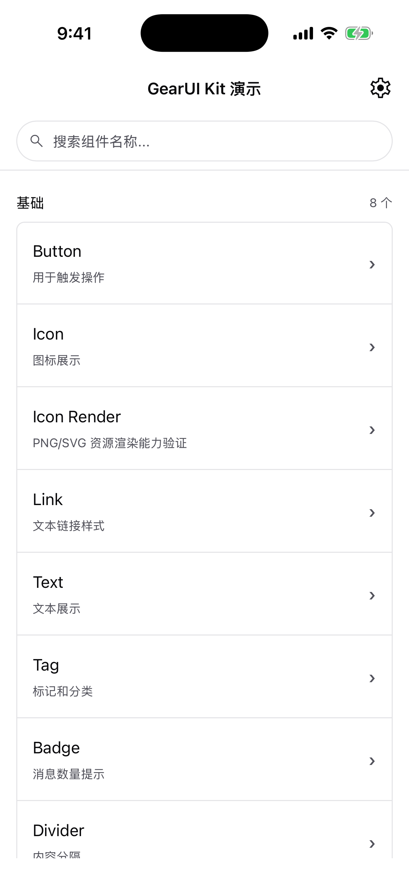
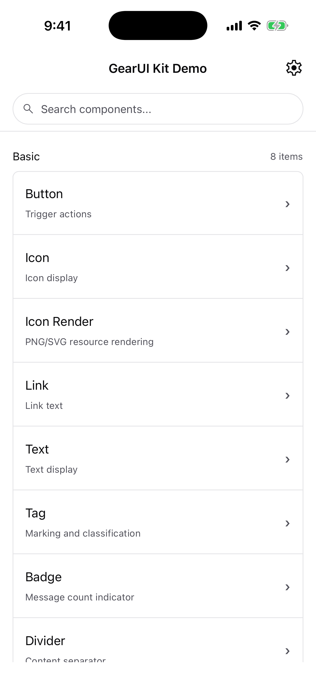
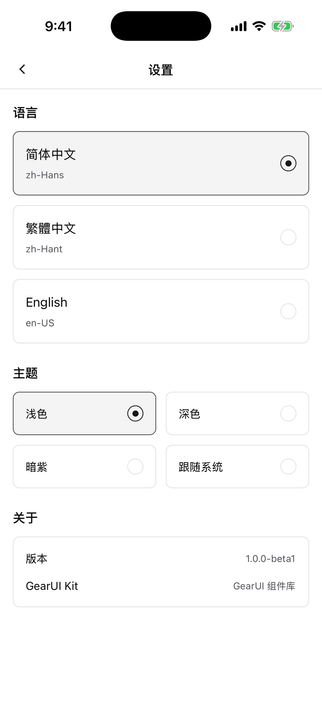
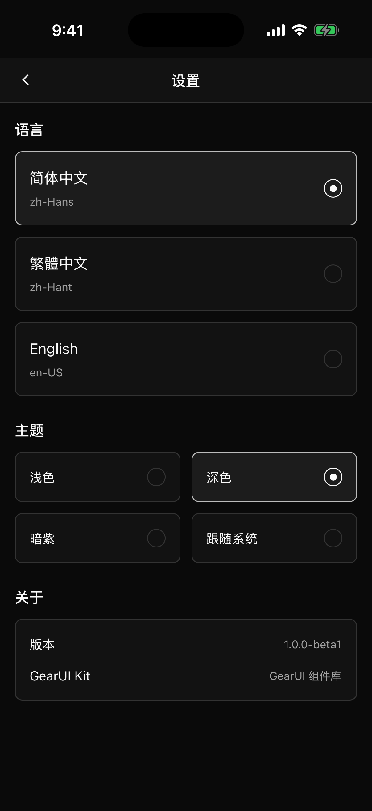

# GearUI Kit

[English](./README.md) | [简体中文](./README.zh-Hans.md)

基于 Kuikly 构建的 Kotlin Multiplatform UI 组件库。

## 发布信息

- 坐标：`com.gearui:gearui-kit:1.0.0-beta1`
- 2026-08-15 起可从 Maven Central 获取（首个公开版本）
- 支持平台：Android、iOS（arm64 / 模拟器 arm64 / x64）、JS（浏览器）
- 官网：[https://gearui.com](https://gearui.com)
- License：BSD 3-Clause License

## 作者信息

- 作者：`zoujiaqing`
- 邮箱：`zoujiaqing@gmail.com`

## 界面截图

在 iPhone 17 Pro 模拟器上运行 sample 截取。

| 首页（中文） | 首页（英文） | 设置页（亮色） | 设置页（暗色） |
| --- | --- | --- | --- |
|  |  |  |  |

语言与主题都在设置页运行时切换，所有组件自动跟随，无需逐屏适配。

## 组件一览

<!-- component-index:begin -->
**72 个组件**，分 6 类，每一个在 sample 里都有对应演示页。

| 分类 | 组件 |
| --- | --- |
| 基础（7） | `Button`、`Icon`、`Link`、`Text`、`Tag`、`Badge`、`Divider` |
| 表单（17） | `Input`、`Checkbox`、`Radio`、`Switch`、`Slider`、`Stepper`、`Textarea`、`Rate`、`Select`、`Picker`、`DatePicker`、`DropdownMenu`、`Upload`、`Form`、`Cascader`、`Transfer`、`TreeSelect` |
| 导航（12） | `NavBar`、`BottomNavBar`、`Tabs`、`NavigationMenu`、`Sidebar`、`Drawer`、`Steps`、`Pagination`、`Breadcrumb`、`Anchor`、`Segmented`、`FAB` |
| 数据展示（15） | `List`、`Card`、`Cell`、`Table`、`Image`、`ImageViewer`、`Avatar`、`Collapse`、`Progress`、`Empty`、`Skeleton`、`Timeline`、`Tree`、`Calendar`、`Watermark` |
| 反馈（15） | `SwipeCell`、`ActionSheet`、`Toast`、`Dialog`、`Tooltip`、`ContextMenu`、`Loading`、`Message`、`NoticeBar`、`Notification`、`Snackbar`、`Popup`、`Popover`、`Result`、`Tour` |
| 布局（6） | `Grid`、`Swiper`、`SearchBar`、`Refresh`、`BottomSheet`、`BackTop` |

<details>
<summary>各组件用途</summary>

**基础**

| 组件 | 中文名 | 用途 |
| --- | --- | --- |
| `Button` | 按钮 | 用于触发操作 |
| `Icon` | 图标 | 图标展示 |
| `Link` | 链接 | 文本链接样式 |
| `Text` | 文本 | 文本展示 |
| `Tag` | 标签 | 标记和分类 |
| `Badge` | 徽标 | 消息数量提示 |
| `Divider` | 分割线 | 内容分隔 |

**表单**

| 组件 | 中文名 | 用途 |
| --- | --- | --- |
| `Input` | 输入框 | 文本输入 |
| `Checkbox` | 复选框 | 多选操作 |
| `Radio` | 单选框 | 单选操作 |
| `Switch` | 开关 | 开关选择 |
| `Slider` | 滑块 | 数值选择 |
| `Stepper` | 步进器 | 数字增减 |
| `Textarea` | 多行输入 | 多行文本输入 |
| `Rate` | 评分 | 评分操作 |
| `Select` | 下拉选择 | 下拉选择器 |
| `Picker` | 选择器 | 多列选择 |
| `DatePicker` | 日期选择 | 日期时间选择 |
| `DropdownMenu` | 下拉菜单 | 筛选下拉菜单 |
| `Upload` | 上传 | 文件上传 |
| `Form` | 表单 | 表单容器 |
| `Cascader` | 级联选择 | 级联选择器 |
| `Transfer` | 穿梭框 | 数据穿梭选择 |
| `TreeSelect` | 树选择 | 树形选择器 |

**导航**

| 组件 | 中文名 | 用途 |
| --- | --- | --- |
| `NavBar` | 导航栏 | H5页面导航栏 |
| `BottomNavBar` | 底部导航栏 | 应用底部主导航 |
| `Tabs` | 选项卡 | 内容切换 |
| `NavigationMenu` | 导航菜单 | 顶部导航菜单 |
| `Sidebar` | 侧边栏 | 侧边导航 |
| `Drawer` | 抽屉 | 侧滑抽屉 |
| `Steps` | 步骤条 | 步骤指示 |
| `Pagination` | 分页 | 页码导航 |
| `Breadcrumb` | 面包屑 | 路径导航 |
| `Anchor` | 锚点 | 页面锚点导航 |
| `Segmented` | 分段控制 | 分段选择 |
| `FAB` | 悬浮按钮 | 浮动操作按钮 |

**数据展示**

| 组件 | 中文名 | 用途 |
| --- | --- | --- |
| `List` | 列表 | 列表展示 |
| `Card` | 卡片 | 卡片容器 |
| `Cell` | 单元格 | 列表单元组件 |
| `Table` | 表格 | 数据表格 |
| `Image` | 图片 | 图片展示 |
| `ImageViewer` | 图片预览 | 图片预览查看 |
| `Avatar` | 头像 | 用户头像 |
| `Collapse` | 折叠面板 | 内容折叠 |
| `Progress` | 进度条 | 进度展示 |
| `Empty` | 空状态 | 空数据提示 |
| `Skeleton` | 骨架屏 | 加载占位 |
| `Timeline` | 时间轴 | 时间线展示 |
| `Tree` | 树 | 树形结构 |
| `Calendar` | 日历 | 日历展示 |
| `Watermark` | 水印 | 页面水印 |

**反馈**

| 组件 | 中文名 | 用途 |
| --- | --- | --- |
| `SwipeCell` | 滑动单元格 | 滑动操作单元格 |
| `ActionSheet` | 动作面板 | 底部动作面板 |
| `Toast` | 轻提示 | 消息提示 |
| `Dialog` | 对话框 | 模态对话框 |
| `Tooltip` | 文字提示 | 文字提示 |
| `ContextMenu` | 上下文菜单 | 上下文菜单 |
| `Loading` | 加载 | 加载状态 |
| `Message` | 消息提醒 | 全局消息提示 |
| `NoticeBar` | 公告栏 | 滚动公告提醒 |
| `Notification` | 通知 | 全局通知 |
| `Snackbar` | 消息条 | 底部消息 |
| `Popup` | 弹出层 | 弹出内容 |
| `Popover` | 气泡 | 气泡提示 |
| `Result` | 结果 | 操作结果反馈 |
| `Tour` | 引导 | 功能引导 |

**布局**

| 组件 | 中文名 | 用途 |
| --- | --- | --- |
| `Grid` | 栅格 | 栅格布局 |
| `Swiper` | 轮播 | 内容轮播 |
| `SearchBar` | 搜索栏 | 搜索输入 |
| `Refresh` | 下拉刷新 | 下拉刷新展示（演示页） |
| `BottomSheet` | 底部抽屉 | 底部弹出 |
| `BackTop` | 回到顶部 | 返回顶部 |

</details>
<!-- component-index:end -->

上表由 `scripts/gen_component_index.py` 从 `sample/.../config/ComponentConfig.kt`
生成；表过期时 CI 会失败。

## 快速接入

### 1. 发布版依赖（推荐）

已发布到 Maven Central。只需声明根坐标一行——Gradle 会读 module metadata，
按当前编译目标自动解析到对应平台包（`-android`、`-js`、`-iosarm64` …）。
那些带后缀的坐标不要手写。

```kotlin
repositories {
    mavenCentral()
}

kotlin {
    sourceSets {
        commonMain.dependencies {
            implementation("com.gearui:gearui-kit:1.0.0-beta1")
        }
    }
}
```

### 2. 本地联调依赖（mavenLocal）

先在 `gearui-kit` 工程发布到本地仓库：

```bash
./gradlew :gearui-kit:publishToMavenLocal
```

然后在业务工程引入：

```kotlin
repositories {
    mavenLocal()
    mavenCentral()
}

kotlin {
    sourceSets {
        commonMain.dependencies {
            implementation("com.gearui:gearui-kit:1.0.0-beta1")
        }
    }
}
```

### 3. 同仓库模块依赖（开发期）

```kotlin
dependencies {
    implementation(project(":gearui-kit"))
}
```

## 基础使用

```kotlin
@Page("MainPage")
class MainPage : View() {
    @Composable
    // View mounts the App root (theme, i18n, overlays, safe area) for you.
    // Override themeMode() / themeSpec() to change it; do not call App() here.
    override fun Content() {
        MainPageContent()
    }
}

@Composable
private fun MainPageContent() {
    val colors = Theme.colors

    Column(
        modifier = Modifier
            .fillMaxSize()
            .background(colors.background)
            .padding(16.dp)
    ) {
        Button(
            text = I18n.strings.buttonConfirm,
            theme = ButtonTheme.PRIMARY,
            onClick = {}
        )
    }
}
```

## 平台支持

| 平台 | 库 | Sample | CI |
|---|---|---|---|
| Android | ✅ | ✅ | ✅ |
| iOS | ✅ | ✅ | ✅ |
| Web (H5) | ✅ | ✅ 76 个演示页中 75 个 | ✅ |
| 鸿蒙 | ⚠️ 能构建未运行 | ⚠️ 能构建未运行 | — |

Web 走 KuiklyUI 的 web 渲染器；唯一失败的 `Table` 是 sample 自身演示文件的
Kotlin/JS 部分链接错误，不在组件本身。详见
[sample/jsApp/README.md](./sample/jsApp/README.md)。

鸿蒙**能构建，但从未运行过**：HAP 已全链路产出，装上去还需要模拟器镜像和已签名的包，两者都要华为开发者账号。它无法作为常规构建的一个 target：带 `ohosArm64`
的 KuiklyUI 产物是基于 Kotlin `2.0.21-KBA-010` 发布的，因此鸿蒙使用一套并行构建配置，
通过 `-c settings.ohos.gradle.kts` 显式驱动。哪些已验证、哪些没有，见
[sample/ohosApp/README.md](./sample/ohosApp/README.md)。

## 工程说明

- 组件层位于：`gearui-kit/src/commonMain/kotlin/com/gearui/components`
- Sample 工程：`sample/`

## 组件收敛策略

- 导航类只保留核心入口：`Tabs`（内容切换）。
- 手风琴模式统一并入：`Collapse.Accordion`（不再单独维护 `Accordion` 组件）。
- 不保留同义包装组件，避免重复 API 和重复示例页面。

## 文档入口

- 架构总览：[ARCHITECTURE.md](./ARCHITECTURE.md)
- 规范入口：[docs/SPEC.md](./docs/SPEC.md)
- 发布流程（维护者）：[docs/RELEASING.zh-Hans.md](./docs/RELEASING.zh-Hans.md)
- Web 宿主：[sample/jsApp/README.md](./sample/jsApp/README.md)
- 鸿蒙宿主：[sample/ohosApp/README.md](./sample/ohosApp/README.md)

文档以英文为主，`*.zh-Hans.md` 为对应中文版。**代码注释一律英文**——
执行该约定的检查见 [docs/SPEC_CI_MAPPING.md](./docs/SPEC_CI_MAPPING.md) 第 18 条。

## 开发命令

```bash
# 分平台编译库
./gradlew :gearui-kit:compileDebugKotlinAndroid
./gradlew :gearui-kit:compileKotlinIosSimulatorArm64
./gradlew :gearui-kit:compileKotlinJs

# 运行 sample
./gradlew :sample:installDebug                    # Android
./gradlew :sample:jsApp:jsBrowserDevelopmentRun   # Web，然后打开 http://localhost:8081/

# 鸿蒙走并行构建配置（尚未构建通过 —— 见 sample/ohosApp/README.md）
./gradlew -c settings.ohos.gradle.kts :sample:linkSharedDebugSharedOhosArm64

# 架构护栏 —— 共 18 条，全部可本地运行
for f in scripts/ci/check_*.sh; do "$f"; done
```

## 许可证

BSD 3-Clause License，详见 [LICENSE](./LICENSE)。
