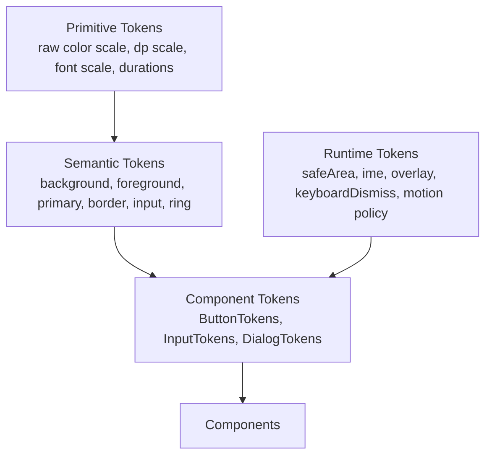

# GearUI Design System Spec

Status: Draft  
Scope: GearUI Kit 1.0 design system governance  
Mode: Design baseline only. No component implementation changes are implied by this document.

## 0. Open Decisions

These decisions must be resolved before Phase 2 audit expansion and before component-family implementation starts.

### 0.1 Visual Lineage - Decided

GearUI Kit adopts an Apple UIKit-inspired mobile visual language, a TDesign Flutter-inspired component architecture, and shadcn-inspired semantic surface tokens.

This means:

- Visual direction: mobile-first, restrained, premium, native-like.
- Component taxonomy: aligned with TDesign-style full component coverage.
- Engineering structure: TDesign Flutter is the main reference for component families, state matrices, examples, and spec discipline.
- Token semantics: closer to shadcn's `background`, `foreground`, `card`, `popover`, `muted`, `border`, `input`, and `ring` model.
- Runtime behavior: centralized like a native UI framework, especially for safe area, keyboard, overlay, focus, and navigation.

GearUI should not copy Apple branding, TDesign visual styling, or shadcn's Web/CSS/Tailwind implementation model. The target positioning is: Apple-like mobile quality, TDesign-like engineering structure, shadcn-like semantic clarity.

### 0.2 Core `Colors` Footprint - Direction Decided

Core `Colors` should be business-neutral and should converge toward a general UI semantic model.

Direction:

- Keep or migrate toward generic semantics such as `background`, `foreground`, `surface`, `card`, `popover`, `muted`, `primary`, `secondary`, `accent`, `destructive`, `border`, `input`, `ring`, `success`, `warning`, and `info`.
- Move product/domain tokens such as chat bubbles out of core.
- If mobile-only pressed/active state colors are needed, prefer component-state tokens instead of growing core `Colors` with every state variant.

Current status:

- `bubbleSelf`, `onBubbleSelf`, `bubbleOther`, and `onBubbleOther` have been removed from GearUI core `Colors`.
- PrivChat implements equivalent chat bubble semantics in its own product-level theme extension (`privchat-ui` `ChatColors`).
- Other applications should define their own product/domain theme extensions instead of adding business semantics back to GearUI core.

Required follow-up:

- Decide the exact business-neutral public `Colors` field list before `1.0.0-rc1`.

### 0.3 Web Target Impact

Decision needed: should Web be treated as a first-class target for the 1.0 token model, or as an experimental renderer until Kuikly Compose Web is confirmed?

Why it matters:

- If Web uses the same Compose component tree, component tokens can remain fully shared.
- If Web needs KRComponent or renderer-specific fallbacks, component tokens must stay target-agnostic and avoid platform-only assumptions.
- Overlay, input, focus, pointer, safe-area, and motion policies are likely to diverge first.

Current stance:

- Web is not the visual axis for 1.0.
- Tokens must remain target-agnostic until the Kuikly Compose Web path is confirmed.
- Runtime policies may have target-specific adapters, but component tokens should not embed Web-only or native-only behavior.

### 0.4 KuiklyUI Runtime Constraints - Decided

GearUI Kit is built on KuiklyUI, so design governance must include runtime constraints, not only visual tokens.

Rules:

- Prefer real mobile behavior over Web token purity.
- Centralize safe area, keyboard, focus, overlay, navigation, and IME policy in Runtime.
- Keep component tokens target-agnostic.
- Any Kuikly-specific workaround must be documented near the code or in the relevant component spec.
- Do not assume Compose `Modifier` handlers can always intercept native scroll/input behavior; verify before deleting local component workarounds.

## 1. Design Principles

GearUI Kit should be a general-purpose UI kit with a coherent mobile-first design language. It may learn from shadcn/ui's hierarchy and restraint, but it should not be a web-token clone.

- Minimal but expressive: visual weight should come from hierarchy, spacing, type, border, and state, not decoration.
- Mobile-first, desktop-ready: default density and touch targets should work on iOS and Android first.
- Shadcn-inspired, not shadcn-cloned: keep the clean surface/border/state model, but adapt it to Kuikly mobile constraints.
- Token-first: components should consume component tokens, not raw primitive values.
- Border and surface before shadow: cards and controls should prefer subtle border/surface changes. Heavy shadows are exceptional.
- Runtime consistency over component freedom: keyboard dismiss, safe area, overlay stacking, and inset behavior are runtime policies.

## 2. Token Layers

GearUI token ownership should be explicit. A component should not freely mix all token layers.



### Primitive Tokens

Raw values only. Examples: color ramps, spacing numbers, radius numbers, duration numbers.

Primitive tokens should not be used directly by components except inside token definitions or documented low-level primitives.

### Semantic Tokens

UI meaning. Examples: `background`, `foreground`, `primary`, `border`, `input`, `ring`.

Semantic tokens define design language. They should remain business-neutral.

### Component Tokens

Component role decisions. Examples: `ButtonTokens`, `InputTokens`, `ActionSheetTokens`.

Components should primarily consume component tokens. Component tokens may map to semantic tokens and primitive tokens.

### Runtime Tokens

Environment and interaction policy. Examples: safe area, IME/keyboard state, overlay stacking, keyboard dismiss mode, motion policy.

Runtime tokens are not component style tokens. Components may request runtime behavior, but should not reimplement global behavior.

## 3. Visual Language

### Surface Hierarchy

Use surfaces to communicate layering before using shadow.

- `background`: page root.
- `surface`: default content surface.
- `card`: grouped content container.
- `popover`: floating overlay content.
- `muted`: low-emphasis interior container.
- `overlay`: translucent layer above page content.
- `scrim`: modal dim layer.

### Content Hierarchy

- `foreground`: primary readable content.
- `mutedForeground`: secondary content, descriptions, metadata.
- `disabledForeground`: disabled content.
- `destructiveForeground`: text on destructive surfaces or destructive text.
- `primaryForeground`: text/icon on primary surfaces.

### Interaction Hierarchy

- `border`: default separation line.
- `input`: input/control border surface.
- `ring`: focus affordance.
- `focus`: focused state.
- `active`: pressed/selected state.
- `disabled`: disabled state.
- `invalid`: validation error state.

## 4. Core Color Semantics

The target semantic color model should be close to this shape. The final public field list must be frozen before `1.0.0-rc1`.

```kotlin
data class Colors(
    val background: Color,
    val foreground: Color,
    val surface: Color,
    val surfaceForeground: Color,
    val card: Color,
    val cardForeground: Color,
    val popover: Color,
    val popoverForeground: Color,
    val primary: Color,
    val primaryForeground: Color,
    val secondary: Color,
    val secondaryForeground: Color,
    val muted: Color,
    val mutedForeground: Color,
    val accent: Color,
    val accentForeground: Color,
    val destructive: Color,
    val destructiveForeground: Color,
    val border: Color,
    val input: Color,
    val ring: Color,
    val success: Color,
    val warning: Color,
    val info: Color,
)
```

Business-specific tokens must not live in core `Colors`. PrivChat chat bubble colors are now implemented outside GearUI core as a product-level `ChatColors` extension; other products should follow the same extension pattern for their own domain colors.

### 4.1 Source Responsibilities

| Source | GearUI Adopts | GearUI Does Not Adopt |
|---|---|---|
| Apple/UIKit | Mobile visual quality, touch target discipline, safe area, navigation, sheets, input behavior, restrained motion | Apple brand styling or exact native component cloning |
| TDesign Flutter | Component coverage, API organization, state matrices, example/spec structure, engineering governance | Full TDesign visual style or legacy token naming as-is |
| shadcn/ui | Surface/content/interaction semantics, border-first hierarchy, muted/input/ring clarity | Web/CSS/Tailwind/Radix implementation model |

## 5. Radius Scale

Recommended public radius scale:

- `none = 0`
- `sm = 4`
- `md = 6`
- `lg = 8`
- `xl = 12`
- `full = 9999`

Rules:

- Components should use component radius tokens.
- Component radius tokens should map to the public radius scale.
- Direct `RoundedCornerShape(x.dp)` inside components requires an explicit exception.

## 6. Spacing Scale

Recommended public spacing scale:

- `0`
- `2`
- `4`
- `6`
- `8`
- `12`
- `16`
- `20`
- `24`
- `32`
- `40`
- `48`

Rules:

- Component padding and gap values should be defined in component tokens.
- Page-level layout spacing may use semantic layout tokens.
- Direct `padding(12.dp)` and `Spacer(width = 8.dp)` inside components should be treated as audit findings unless the component is itself defining a token.

## 7. Typography Scale

Recommended semantic type roles:

- `display`: rare, large marketing/title surfaces.
- `headline`: page or major section title.
- `title`: component title or card title.
- `body`: normal readable content.
- `label`: controls, field labels, buttons.
- `caption`: low-emphasis metadata.

Rules:

- Components should use semantic typography roles.
- Component-specific typography may be exposed through component tokens.
- Avoid component-local font sizes unless defining tokens.

## 8. Motion Scale

Recommended public motion scale:

- `instant = 0ms`
- `fast = 100ms`
- `normal = 150ms`
- `slow = 200ms`
- `emphasized = 250ms`

Rules:

- Components should not invent one-off durations.
- Overlay entrance/exit should use shared runtime motion policy.
- Motion should be subtle on mobile; state feedback must not block input responsiveness.

## 8.1 Icon Size Scale

Recommended public icon scale should stay small until real component demand proves otherwise:

- `sm`: compact inline icons.
- `md`: default control icons.
- `lg`: prominent icons, nav affordances, empty states.
- `xl`: rare illustration-like component icons.

Rules:

- Do not introduce position-specific roles such as `nav` or `avatarAccessory` until multiple components require them.
- Component tokens may alias these base sizes, for example `ButtonTokens.iconSize = IconSize.md`.

## 9. Elevation Policy

GearUI should prefer shadcn-like surface discipline:

- Cards default to border, not shadow.
- Heavy shadows are not a default container affordance.
- Floating overlays may use scrim + popover surface + light shadow.
- Elevation must be named and tokenized.
- If a component uses shadow, it should be documented as an elevation role.

## 10. Touch Target Policy

- Default interactive target should be at least `44dp`.
- Compact visual controls may be smaller only if their hit target remains at least `44dp`.
- Reduced target size must be documented by the component.
- Icon-only controls should not rely on icon bounds as hit bounds.

## 11. Runtime Interaction Policy

The runtime layer owns global interaction behavior:

- Keyboard dismissal on tap or scroll.
- Current focused input tracking.
- Overlay stack ordering and modal scrim handling.
- Safe area and IME insets.
- Back handling for overlays and pages.

Components should expose intent and callbacks. They should not duplicate global tap/scroll keyboard-dismiss logic unless a platform limitation requires a documented local workaround.

## 12. Component Family Rollout Order

Design changes should land by component family, not by isolated files:

1. Theme, spacing, radius, motion, elevation.
2. Text, icon, badge, avatar primitives.
3. Button, checkbox, radio, switch, slider.
4. Input, search bar, textarea, form.
5. Overlay, dialog, popup, bottom sheet, action sheet, select.
6. Card, cell, list item, section header.
7. NavBar, BottomNavBar, PageScaffold, runtime insets.

## 13. 1.0 Acceptance Gates

Before 1.0 RC:

- Public token names are frozen.
- Core tokens are business-neutral.
- Component families use component tokens.
- Hardcoded color values are rejected outside token/theme definitions.
- Hardcoded spacing/radius/duration values are either token definitions or documented exceptions.
- Overlay and safe-area behavior is centralized.
- Samples include a design-system gallery that exercises light/dark, states, density, and overlays.
