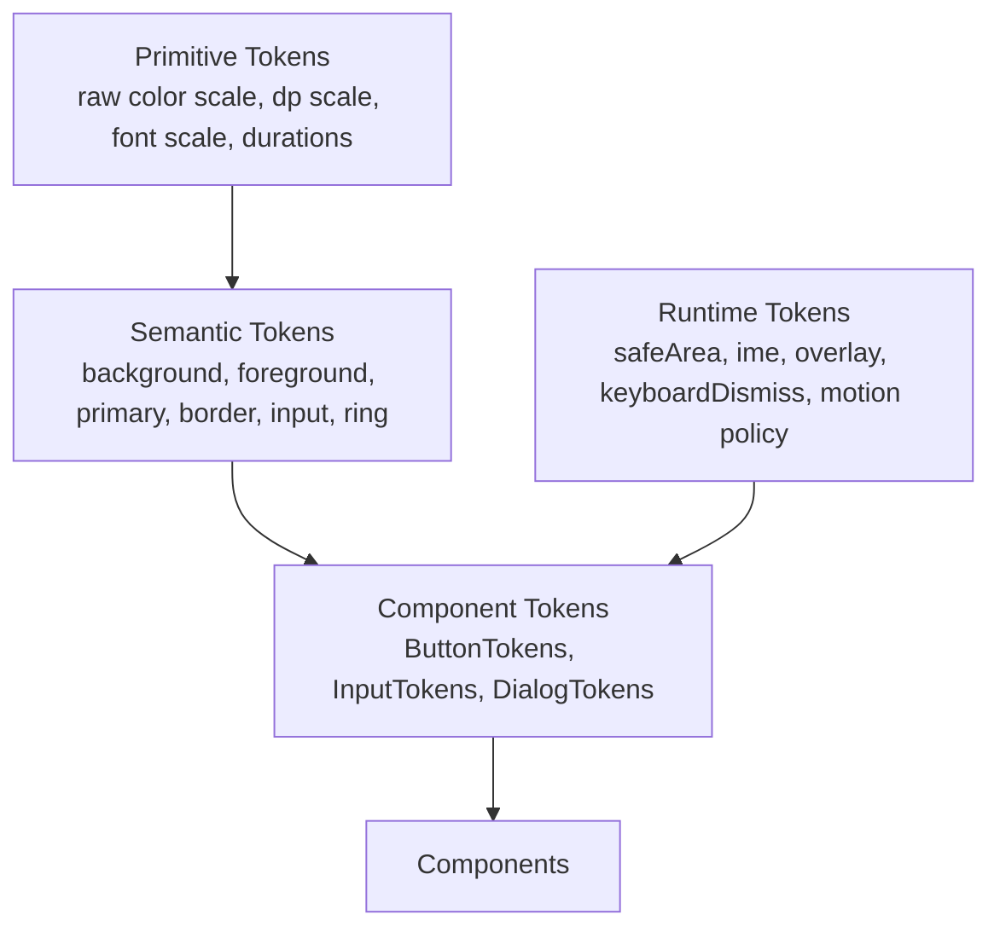

# GearUI Design System Spec

Status: Draft  
Scope: GearUI Kit 1.0 design system governance  
Mode: Design baseline only. No component implementation changes are implied by this document.

## 0. Open Decisions

These decisions must be resolved before Phase 2 audit expansion and before component-family implementation starts.

### 0.1 Visual Identity - Decided

GearUI adopts **iOS 26 as its default visual and interaction reference**, with the
adjustments a cross-platform kit needs, while retaining its own component
architecture, public API, runtime contracts, and cross-platform implementation.
It does not reproduce Apple-specific system materials or Liquid Glass
refraction. Brand appearance remains customizable through replaceable design
tokens.

There is **one design language**, not a style engine. Tokens exist for
brand skinning and detail tuning — colour, typography, radius, motion,
elevation, sizing. They are not a mechanism for switching GearUI into
Material, TDesign, or any other language, and GearUI does not ship two
anatomies per component. Anatomy is decided once, in §11.x, and applies on
every platform.

Why iOS 26 and not a house style: a general-purpose kit has to pick a visual
baseline, and inventing one from nothing costs design time this project does
not have while producing something users have no prior model for. iOS 26's
flat form is well specified, familiar to the target market, and already the
convention most apps here follow on both platforms.

Why not Liquid Glass: it is not a blur. It is real-time refraction with
specular response to the content behind it, implemented as an iOS system
material. Cross-platform reproduction is not feasible, and an approximation
would look wrong beside the real thing. GearUI supports **cross-platform
frosted glass** as a material of its own (§11.2) and stops there.

Remaining influences, as design references rather than identity:

- **TDesign** contributes component architecture, coverage, and documentation discipline.
- **shadcn** contributes semantic token clarity, especially surface, foreground, muted, border, input, and ring role naming.
- **KuiklyUI** defines the runtime implementation boundary across Kotlin KMP targets.

All public presentation is normalized through GearUI tokens, GearUI component
tokens, and GearUI runtime contracts.

### 0.2 Core `Colors` Footprint - Direction Decided

Core `Colors` should be business-neutral and should converge toward a general UI semantic model.

Direction:

- Keep or migrate toward generic semantics such as `background`, `foreground`, `surface`, `card`, `popover`, `muted`, `primary`, `secondary`, `accent`, `destructive`, `border`, `input`, `ring`, `success`, `warning`, and `info`.
- Move product/domain tokens such as chat bubbles out of core.
- If mobile-only pressed/active state colors are needed, prefer component-state tokens instead of growing core `Colors` with every state variant.

Current status:

- `bubbleSelf`, `onBubbleSelf`, `bubbleOther`, and `onBubbleOther` have been removed from GearUI core `Colors`.
- PrivChat implements equivalent chat bubble semantics in its own product-level theme extension (`privchat-ui` `ChatColors`).
- Other applications should define their own product/domain theme extensions instead of adding business semantics back to GearUI core.

Required follow-up:

- Decide the exact business-neutral public `Colors` field list before `1.0.0-rc1`.

### 0.3 Web Target Impact

Decision needed: should Web be treated as a first-class target for the 1.0 token model, or as an experimental renderer until Kuikly Compose Web is confirmed?

Why it matters:

- If Web uses the same Compose component tree, component tokens can remain fully shared.
- If Web needs KRComponent or renderer-specific fallbacks, component tokens must stay target-agnostic and avoid platform-only assumptions.
- Overlay, input, focus, pointer, safe-area, and motion policies are likely to diverge first.

Current stance:

- Web is not the visual axis for 1.0.
- Tokens must remain target-agnostic until the Kuikly Compose Web path is confirmed.
- Runtime policies may have target-specific adapters, but component tokens should not embed Web-only or native-only behavior.

### 0.4 KuiklyUI Runtime Constraints - Decided

GearUI Kit is built on KuiklyUI, so design governance must include runtime constraints, not only visual tokens.

Rules:

- Prefer real mobile behavior over Web token purity.
- Centralize safe area, keyboard, focus, overlay, navigation, and IME policy in Runtime.
- Keep component tokens target-agnostic.
- Any Kuikly-specific workaround must be documented near the code or in the relevant component spec.
- Do not assume Compose `Modifier` handlers can always intercept native scroll/input behavior; verify before deleting local component workarounds.

## 1. Design Principles

GearUI Kit is a general-purpose mobile-first UI kit with one coherent design language. Influences are absorbed into GearUI's own system; no upstream framework should remain visible at the API or visual layer.

- Minimal but expressive: visual weight should come from hierarchy, spacing, type, border, and state, not decoration.
- Mobile-first, desktop-ready: default density and touch targets should work on iOS and Android first.
- One design language: TDesign / Apple / shadcn references are normalized into GearUI conventions; downstream code should not need to know which influence shaped which token.
- Token-first: components should consume component tokens, not raw primitive values.
- Border and surface before shadow: cards and controls should prefer subtle border/surface changes. Heavy shadows are exceptional.
- Runtime consistency over component freedom: keyboard dismiss, safe area, overlay stacking, and inset behavior are runtime policies.

## 2. Token Layers

GearUI token ownership should be explicit. A component should not freely mix all token layers.



### Primitive Tokens

Raw values only. Examples: color ramps, spacing numbers, radius numbers, duration numbers.

Primitive tokens should not be used directly by components except inside token definitions or documented low-level primitives.

### Semantic Tokens

UI meaning. Examples: `background`, `foreground`, `primary`, `border`, `input`, `ring`.

Semantic tokens define design language. They should remain business-neutral.

### Component Tokens

Component role decisions. Examples: `ButtonTokens`, `InputTokens`, `ActionSheetTokens`.

Components should primarily consume component tokens. Component tokens may map to semantic tokens and primitive tokens.

### Runtime Tokens

Environment and interaction policy. Examples: safe area, IME/keyboard state, overlay stacking, keyboard dismiss mode, motion policy.

Runtime tokens are not component style tokens. Components may request runtime behavior, but should not reimplement global behavior.

## 3. Visual Language

### Surface Hierarchy

Use surfaces to communicate layering before using shadow.

- `background`: page root.
- `surface`: default content surface.
- `card`: grouped content container.
- `popover`: floating overlay content.
- `muted`: low-emphasis interior container.
- `overlay`: translucent layer above page content.
- `scrim`: modal dim layer.

### Content Hierarchy

- `foreground`: primary readable content.
- `mutedForeground`: secondary content, descriptions, metadata.
- `disabledForeground`: disabled content.
- `destructiveForeground`: text on destructive surfaces or destructive text.
- `primaryForeground`: text/icon on primary surfaces.

### Interaction Hierarchy

- `border`: default separation line.
- `input`: input/control border surface.
- `ring`: focus affordance.
- `focus`: focused state.
- `active`: pressed/selected state.
- `disabled`: disabled state.
- `invalid`: validation error state.

## 4. GearUI Semantic Color Model

The GearUI semantic color model uses surface / content / interaction roles. Field names below follow GearUI conventions; while some are inspired by shadcn role naming, the model itself is GearUI's. The final public field list must be frozen before `1.0.0-rc1`.

```kotlin
data class Colors(
    val background: Color,
    val foreground: Color,
    val surface: Color,
    val surfaceForeground: Color,
    val card: Color,
    val cardForeground: Color,
    val popover: Color,
    val popoverForeground: Color,
    val primary: Color,
    val primaryForeground: Color,
    val secondary: Color,
    val secondaryForeground: Color,
    val muted: Color,
    val mutedForeground: Color,
    val accent: Color,
    val accentForeground: Color,
    val destructive: Color,
    val destructiveForeground: Color,
    val border: Color,
    val input: Color,
    val ring: Color,
    val success: Color,
    val warning: Color,
    val info: Color,
)
```

Business-specific tokens must not live in core `Colors`. PrivChat chat bubble colors are now implemented outside GearUI core as a product-level `ChatColors` extension; other products should follow the same extension pattern for their own domain colors.

### 4.1 Source Responsibilities

| Source | GearUI Adopts | GearUI Does Not Adopt |
|---|---|---|
| Apple/UIKit | Mobile visual quality, touch target discipline, safe area, navigation, sheets, input behavior, restrained motion | Apple brand styling or exact native component cloning |
| TDesign Flutter | Component coverage, API organization, state matrices, example/spec structure, engineering governance | Full TDesign visual style or legacy token naming as-is |
| shadcn/ui | Surface/content/interaction semantics, border-first hierarchy, muted/input/ring clarity | Web/CSS/Tailwind/Radix implementation model |

## 5. Radius Scale

Recommended public radius scale:

- `none = 0`
- `sm = 4`
- `md = 6`
- `lg = 8`
- `xl = 12`
- `full = 9999`

Rules:

- Components should use component radius tokens.
- Component radius tokens should map to the public radius scale.
- Direct `RoundedCornerShape(x.dp)` inside components requires an explicit exception.

## 6. Spacing Scale

The shipped scale, an 8pt grid with a half step:

| token | value | |
|---|---|---|
| `none` | 0 | |
| `xs` | 4 | 0.5x |
| `sm` | 8 | 1x, the base unit |
| `md` | 12 | 1.5x — most used |
| `lg` | 16 | 2x |
| `xl` | 24 | 3x |
| `xxl` | 32 | 4x |
| `xxxl` | 40 | 5x |
| `huge` | 48 | 6x |
| `massive` | 64 | 8x |

Rules:

- Component padding and gap values should be defined in component tokens.
- Page-level layout spacing may use semantic layout tokens.
- Direct `padding(12.dp)` and `Spacer(width = 8.dp)` inside components should be treated as audit findings unless the component is itself defining a token.

### 6.1 Spacing vs Geometry — what the theme may move

Spacing and geometry are different axes that happen to share a unit, and the
scale holds convenient round numbers, so geometry drifts into it. The rule:

**Spacing** is blank space between things — `padding`, `Arrangement.spacedBy`,
`Spacer` extents, a filled gap band. It describes *density*. A brand that wants
a denser or airier product is asking to move exactly these, and nothing else.

**Geometry** is how big a thing is — a status dot's diameter, an icon tile, a
tap target, a stroke width, a row height. Making a product airier must not
inflate its red dots. Geometry lives in the component's own `*Tokens` object
(`ActionSheetTokens`, `FieldSizeTokens`, `AvatarSizeTokens`, `IconSizes`,
`BorderWidth`) and stays static.

Measured across the component layer: of 329 `Spacing.*` references, 325 are
genuine spacing and 4 were geometry borrowing the scale — an 8dp dot written as
`Spacing.sm`, a 48dp icon tile as `Spacing.huge`. Those four now sit in
`ActionSheetTokens`.

### 6.2 Why `Spacing` is not yet a theme axis

Density qualifies as a brand axis on the reasoning above, so `Spacing` should
eventually resolve through `Theme.spacing` the way colour, typography, shapes,
elevation and motion do. It does not yet, and the blocker is not spacing.

A second, static token layer sits in `foundation/`: top-level objects
(`FieldSizeTokens`, `SwipeCellDefaults`, `CardDefaults`, `TabSizeTokens`,
`TagSizeTokens`, `AvatarSizeTokens`, `CellDefaults`) that read `Spacing` at
class-initialisation time. `Theme.spacing` would be a `@Composable` getter,
which these objects cannot call, so they would silently keep the default
spacing while the rest of the library followed the brand — worse than not
theming it at all.

That layer has a second problem, already visible: it drifts. `BadgeSizeTokens`
describes a badge scale no component reads — the `Badge` primitive hardcodes
20/16/10/8dp of its own, and the two no longer agree. `SectionTokens` and
`DividerTokens` had rotted the same way with zero consumers and have been
deleted. `CardDefaults.Flat` and `.Compact` are `copy()` calls that change
nothing.

Order of work: resolve the static token layer through the theme first, then
`Theme.spacing` follows mechanically. Doing it in the other order ships an axis
that is only two-thirds connected.

## 7. Typography Scale

Recommended semantic type roles:

- `display`: rare, large marketing/title surfaces.
- `headline`: page or major section title.
- `title`: component title or card title.
- `body`: normal readable content.
- `label`: controls, field labels, buttons.
- `caption`: low-emphasis metadata.

Rules:

- Components should use semantic typography roles.
- Component-specific typography may be exposed through component tokens.
- Avoid component-local font sizes unless defining tokens.
- Read the scale through `Theme.typography.*`, never through the static
  `Typography.*` object. Enforced by
  `scripts/ci/check_component_static_typography.sh`.

Two representations of the scale exist and mean different things:

| | What it is | Who names it |
|---|---|---|
| `foundation.typography.Typography` | the default values, written down once | `Typographies.Default` only |
| `theme.Typography` / `Theme.typography` | the themeable axis a brand replaces | all component code |

They carry the same `TextStyle` type, so the second is a drop-in for the first.
Until they were unified, `theme.Typography` held Kuikly's `TextStyle` while
components consumed the foundation one; no component could read a field off the
themed scale, and typography was the one axis a brand could not replace. A
`Text` with no explicit `style` now resolves its default through the theme.

## 8. Motion Scale

Recommended public motion scale:

- `instant = 0ms`
- `fast = 100ms`
- `normal = 150ms`
- `slow = 200ms`
- `emphasized = 250ms`

Rules:

- Components should not invent one-off durations.
- Overlay entrance/exit should use shared runtime motion policy.
- Motion should be subtle on mobile; state feedback must not block input responsiveness.

## 8.1 Icon Size Scale

Recommended public icon scale should stay small until real component demand proves otherwise:

- `sm`: compact inline icons.
- `md`: default control icons.
- `lg`: prominent icons, nav affordances, empty states.
- `xl`: rare illustration-like component icons.

Rules:

- Do not introduce position-specific roles such as `nav` or `avatarAccessory` until multiple components require them.
- Component tokens may alias these base sizes, for example `ButtonTokens.iconSize = IconSize.md`.

## 9. Elevation Policy

GearUI prefers surface/border discipline over heavy shadow:

- Cards default to border, not shadow.
- Heavy shadows are not a default container affordance.
- Floating overlays may use scrim + popover surface + light shadow.
- Elevation must be named and tokenized.
- If a component uses shadow, it should be documented as an elevation role.

## 10. Touch Target Policy

- Default interactive target should be at least `44dp`.
- Compact visual controls may be smaller only if their hit target remains at least `44dp`.
- Reduced target size must be documented by the component.
- Icon-only controls should not rely on icon bounds as hit bounds.

## 11. Runtime Interaction Policy

The runtime layer owns global interaction behavior:

- Keyboard dismissal on tap or scroll.
- Current focused input tracking.
- Overlay stack ordering and modal scrim handling.
- Safe area and IME insets.
- Back handling for overlays and pages.

Components should expose intent and callbacks. They should not duplicate global tap/scroll keyboard-dismiss logic unless a platform limitation requires a documented local workaround.

## 11.1 Component Anatomy: Modal Alerts

The token scales say what values exist; they do not say where things go. That
gap is how the dialog family drifted into a desktop layout — left-aligned text
with one filled button in the bottom-right corner — while every individual
token in it was legal. Anatomy rules are the missing half, written per family
as each is revisited.

Applies to `Dialog`, `ConfirmDialog`, `AlertDialog`.

**Structure.** Title, optional message, optional content, then actions. Nothing
is placed beside the actions and no action is placed inline with the text.

**Alignment.** Title and message are centred, and centred per line: a wrapped
message must not leave a ragged left edge. This is why `Text` carries
`textAlign` rather than relying on the parent's `horizontalAlignment`.

**Title.** Expected, not optional-by-default. The title is the question being
asked; the message supports it. A message-only dialog is permitted but must
promote the message to primary styling (`foreground`, `BodyMedium`) and drop
the top padding one step, or it reads as a dialog whose title failed to load.

**Actions.** Full-width rows under a hairline, one per row, `44dp` each,
separated by hairlines. Exactly two short actions may sit side by side, split
by a vertical hairline. No filled buttons: emphasis comes from weight and
tint, not from a filled rectangle competing with the page behind the scrim.

**Roles, not colours.** Callers declare intent — `NORMAL`, `PRIMARY`,
`DESTRUCTIVE`, `CANCEL` — and the component maps it to tint and weight.
`CANCEL` is always rendered last regardless of the order passed in, so backing
out never moves between dialogs.

**Width.** `270-320dp`. Wider reads as a card rather than an alert.

## 11.2 Materials (Frosted Glass)

GearUI's one borrowed *physical* effect. A material is a translucent surface
that blurs its backdrop: a Gaussian blur with a surface tint over it, and
nothing else. Not Liquid Glass — no refraction, no lensing, no specular edge.
See §0.1.

Three steps, named for the surface rather than for a thickness:

| material | radius | tint | for |
|---|---|---|---|
| `Materials.Chrome` | 12.5 | 0.72 | bars over scrolling content — NavBar, BottomNavBar |
| `Materials.Sheet` | 12.5 | 0.82 | modal surfaces — ActionSheet, BottomSheet |
| `Materials.Popover` | 10 | 0.78 | anchored transient surfaces — Popover, Dropdown, Tooltip |

12.5 is the ceiling because `BlurAttr.blurRadius` clamps there on every
platform. Materials carry no colour: the tint is `Theme.colors.surface`, so
they follow the brand and dark mode without a second copy of either.

### Degradation

**When the blur does not run, the translucency goes with it.** The fallback is
`Theme.colors.surface` at full opacity — never the same tint without the blur.

A tint is calibrated against a blurred, low-frequency backdrop. Over raw
content it stops being a material and becomes a wash, and whether the text on
it is legible depends on the user's data. "Keep it slightly glassy so it still
looks nice" is the version of this fallback that ships unreadable screens.

`MaterialPolicy.Auto` decides per platform, and each branch is a property of
KuiklyUI's renderer rather than a preference:

| platform | blur | why |
|---|---|---|
| iOS / macOS | yes | `KRBlurView` is a `UIVisualEffectView`, composited by the system |
| Android 31+ | yes | `KRBlurView` selects `RenderEffectBlur`, a GPU effect |
| Android < 31 | **no** | it falls back to `RenderScriptBlur`, which captures the decor view into a bitmap and blurs it on the CPU every frame the backdrop changes. `minSdk` is 21, so this is not a rare device |
| HarmonyOS | yes | `KRBlurView.ets` is a system effect |
| Web | **no** | policy, not performance — see below |
| anything else | no | an unknown renderer degrades to a flat surface, which is always legible |

Web is excluded because CSS `backdrop-filter` **fails open**. A browser without
support ignores the declaration silently, leaving the tint behind as a plain
wash, and nothing reaches Kotlin to say it did not take — GearUI cannot detect
the failure and correct it. A host that knows its browsers opts in with
`MaterialPolicy.Always`.

### Implementation note

The blur is a KuiklyUI **core** `BlurView` mounted through
`MakeKuiklyComposeNode`, not a modifier: the compose layer has no
`Modifier.blur`, and `RenderNodeLayer` carries a `renderEffect` field with a
`// todo` where it would be applied. `BlurView` is a leaf and cannot host
children, so it sits as a sibling behind the content rather than as its parent.

### Shipping state: off

**`materialPolicy` defaults to `Never`, so 1.0 is an iOS 26 baseline without
frosted glass.** This is not a missing capability — KuiklyUI blurs on all four
renderers — but the renderers do not agree on what a blur *is*, and two of the
disagreements are disqualifying for a kit whose reference is iOS:

- the same `blurRadius` is scaled by ≈40× on Android, ×5 on web, ×1 on
  HarmonyOS, and turned into a 0–1 animator fraction on iOS
- iOS is hardcoded to `UIBlurEffectStyleLight`, so a dark theme gets a *light*
  frosted panel on the one platform GearUI is matching

`docs/UPSTREAM_KUIKLYUI_BLUR.md` records all four findings with source
citations and proposes the upstream fixes. Turning glass on afterwards is one
default.

`MaterialPolicy.Auto` and `Always` are implemented and verified; the sample's
Material Probe page forces them on, which is how the cross-renderer
calibration stays visible.

### Verified

Measured on a real device (Android 16, API 36, RenderEffect backend) through
the `Material Probe` sample page, over a backdrop that is half solid block and
half fine stripes — fine stripes alone prove nothing, because a 12.5pt Gaussian
averages them to a flat tone and a *failed* blur produces a flat tone too.

- blur on: surface luminance 80.6 → 66.1 → 51.0 left to right, a monotonic
  gradient tracking the backdrop, mid-band stdev 2.42
- forced flat: 18.0 / 18.0 / 18.0, stdev 0.00 — opaque, zero backdrop leakage

iOS, HarmonyOS and web follow from the renderer sources cited above and have
not been run.

### Not yet adopted

No component renders a material, and none should while the default is off.
NavBar, BottomNavBar, ActionSheet and BottomSheet are the intended first
adopters once upstream lands, and each is a visible change of its own.

## 12. Component Family Rollout Order

Design changes should land by component family, not by isolated files:

1. Theme, spacing, radius, motion, elevation.
2. Text, icon, badge, avatar primitives.
3. Button, checkbox, radio, switch, slider.
4. Input, search bar, textarea, form.
5. Overlay, dialog, popup, bottom sheet, action sheet, select.
6. Card, cell, list item, section header.
7. NavBar, BottomNavBar, PageScaffold, runtime insets.

## 13. 1.0 Acceptance Gates

Before 1.0 RC:

- Public token names are frozen.
- Core tokens are business-neutral.
- Component families use component tokens.
- Hardcoded color values are rejected outside token/theme definitions.
- Hardcoded spacing/radius/duration values are either token definitions or documented exceptions.
- Overlay and safe-area behavior is centralized.
- Samples include a design-system gallery that exercises light/dark, states, density, and overlays.
